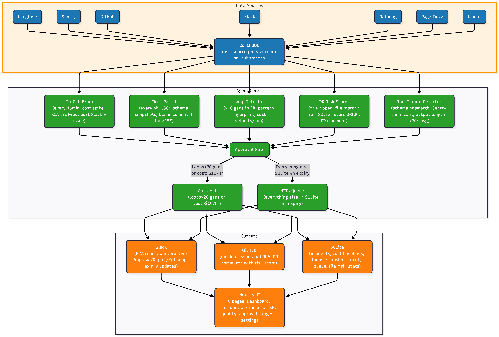
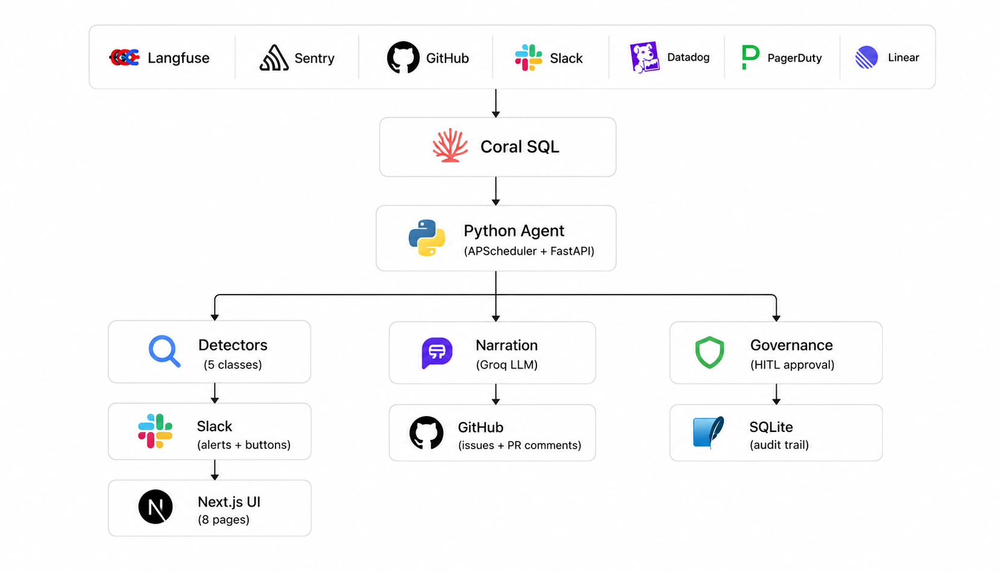

# Sentinel

Sentinel is an AI-powered engineering observability agent built for the **Pirates of the Coral-bean** hackathon (WeMakeDevs × Coral). It cross-queries 7 production data sources through a single SQL layer, detects five classes of AI system failures, narrates root causes in plain English, and routes every remediation through a human approval gate before anything executes.

The core problem it solves: when an AI-powered product breaks in production, the failure signal is almost never in one place. Cost anomalies live in Langfuse. Errors live in Sentry. The deploy that caused them lives in GitHub. The on-call conversation lives in Slack. A developer diagnosing an incident has to open four tabs, correlate timestamps manually, and write the post-mortem from memory. Sentinel eliminates that entirely — it joins all four data sources in a single SQL query, detects the anomaly automatically, writes the RCA using an LLM, and notifies the right people with an actionable report and one-click remediation buttons before the developer has even opened their laptop.

Built for **Pirates of the Coral-bean** (WeMakeDevs × Coral).


## The Problem Space

AI applications introduce a class of production failures that traditional observability tools are not built to catch.

A runaway agent loop burns $40 in tokens before anyone notices — not because it threw an exception, but because it silently retried the same tool call 30 times. A prompt template change shipped on Tuesday caused the support-bot to start returning `{"answer": "...", "score": 0.9}` instead of the expected `{"response": "...", "confidence": 0.9, "category": "billing"}` — downstream consumers started failing silently, and no Sentry alert fired because there was no Python exception. A PR that touched the retry logic file has historically caused a 3x spike in LLM cost every time it's been merged, but the reviewer has no way to know that from the diff alone.

These are the five failure classes Sentinel detects:

**Cost spikes.** LLM API costs can 10x in under an hour when an agent loops or a max_tokens parameter is misconfigured. Sentinel computes a rolling 7-day hourly average from Langfuse, compares every new hour against it, and triggers an investigation when the current hour exceeds 2.5× the baseline. It does not just alert — it immediately queries Sentry for correlated errors and GitHub for commits in the preceding 48 hours, then narrates the full picture.

**Error cascades.** Sentry errors that spike in volume and co-occur with elevated LLM generation counts indicate that an AI system is retrying in response to failures, amplifying both the error rate and the cost. Sentinel detects this correlation with a cross-source join between `sentry.issues` and `langfuse.observations` using their overlapping time windows.

**Prompt drift.** When a prompt template or model parameter changes, the structure of LLM outputs can shift in ways that break downstream consumers without throwing any exception. Sentinel captures a JSON schema snapshot of each feature's outputs on first observation. On every subsequent patrol cycle, it validates the latest 20 outputs against that snapshot. A fail rate above 15% triggers a drift event, and Sentinel immediately queries GitHub for the most recent commit that mentioned "prompt", "template", "system", or "model" in its message within the prior 48 hours — that's the blame commit.

**Agent loops.** An agent that calls the same tool repeatedly without making progress will accumulate GENERATION observations on the same `trace_id` at an abnormal rate. Sentinel queries Langfuse for any trace with more than 10 generations in a 2-hour window, fingerprints the loop by counting how many times each observation name appears (e.g. `retry-search x14`), computes cost velocity in dollars per minute, and fires a Slack alert with a Kill Loop button.

**Silent tool failures.** Tool calls that return successfully at the HTTP level but produce wrong, empty, or malformed outputs are the hardest class of failure to detect because nothing in the stack throws an error. Sentinel runs three detection strategies in parallel: it looks for SPAN observations whose output type changed from JSON to non-JSON (schema failure), it cross-references SPAN timestamps against Sentry issue windows within 5 minutes (correlation failure), and it computes a rolling average output length per tool name to catch observations whose output is less than 20% of historical average (output anomaly).


## Architecture

The system has four layers.

**The data layer** is Coral SQL. Every data source — Langfuse, Sentry, GitHub, Slack, Datadog, PagerDuty, Linear — is registered as a Coral source and queried through a single subprocess call: `coral sql --format json "<query>"`. This means Sentinel can write a single SQL statement that joins GitHub commits with Sentry issues and Langfuse observations across their shared time windows, with no bespoke API client code per source. The Langfuse source is a custom spec we wrote and open-sourced in `sources/langfuse/` — it exposes five tables (traces, observations, scores, sessions, projects) over HTTP Basic Auth with page-based pagination.

**The agent layer** is a set of Python detectors and modes scheduled by APScheduler. The On-Call Brain runs every 15 minutes, checks for cost spikes, and if triggered runs the full 7-step investigation pipeline. The Drift Patrol runs every 4 hours and scans all active features for schema contract violations. A weekly digest runs every Monday at 09:00 and produces a structured three-section summary of what shipped, what broke, and what to watch. PR risk scoring is triggered on-demand per PR number and posts directly to GitHub.

**The governance layer** sits between detection and execution. Every anomaly result carries a `suggested_action` and a `requires_approval` flag. The approval gate inspects the anomaly — if it's a loop with more than 20 generations, or a cost spike already past $10/hr, it auto-acts immediately and posts a notification. Everything else is written to an `approval_queue` table in SQLite and surfaced as an interactive Slack message with Approve and Reject buttons. Approvals expire after 4 hours with the Slack message updating in place.

**The web layer** is a Next.js command center that reads from the FastAPI backend. It gives a live view of every table in the system: active incidents, loop detections with fingerprints, drift events with blame commits, the HITL approval queue, PR risk history, the forensics causal graph, and the weekly digest.






## How Each Component Works

### Coral client

The entire data access layer is 19 lines. `coral_client.py` runs `coral sql --format json` as a subprocess, parses the last line of stdout as a JSON array, and returns it. All cross-source joins happen inside the SQL string — there is no ORM, no per-source HTTP client, no pagination logic in Python. The Coral binary handles authentication, pagination, and result merging across sources. This is the architectural decision that made everything else tractable in a hackathon timeframe.

### Query library

Seven SQL templates cover the full detection surface:

`cost_spike_detection` groups Langfuse GENERATION observations by hour over the last 24 hours, returning hourly cost, generation count, and average cost per call. This feeds both the spike detector and the rolling baseline calculator.

`commit_to_cost_blame` joins `github.commits` with `sentry.issues` and `langfuse.observations` across the 24-hour window following each commit. The result is a ranked list of commits sorted by the cost they correlated with — the top entry is almost always the blame commit.

`error_cascade_detection` joins Sentry issues with Langfuse GENERATION observations on overlapping time windows, filtering for cases where the associated LLM cost exceeded $1. This finds the cases where Sentry errors triggered retry behavior that amplified costs.

`slack_incident_context` pulls messages from incident-adjacent Slack channels (`#incidents`, `#engineering`, `#backend`, `#alerts`) in the time window of the detected anomaly. This gives the narrator real human context — what the team was saying when the spike happened.

`loop_fingerprint_q17` fetches the full observation chain for a specific trace, sorted by time. Combined with a `Counter` over observation names, this produces the loop's tool pattern histogram and cost velocity.

`agent_loop_detection` and `loop_detection_q16` find traces with generation counts above threshold in recent time windows. The difference is the time window: the first looks at the last hour for quick alerting, the second looks at the last 2 hours for the scheduled detector.

### Anomaly detector

The `AnomalyDetector` class orchestrates all four detectors and returns `AnomalyResult` dataclass instances. Each result carries: `type`, `severity` (info / medium / high / critical), `description`, `metadata`, `requires_approval`, and `suggested_action`. The severity thresholds are concrete: a loop is `critical` if generation count exceeds 20, otherwise `high`. A cost spike is `critical` if the ratio exceeds 5×, otherwise `high`. This drives the governance split between auto-act and HITL.

### Smart sampler

Before the On-Call Brain runs detection, it scores every trace from the last 24 hours and drops the ones that carry no signal. The scoring rules are: has_error flag or WARNING/ERROR level → +100, cost more than 2× baseline average → +80, schema validation failed → +70, novel tool pattern not seen in this session → +60, generation count above 5 → +40. Any trace scoring below 40 is dropped. The stats (total, sampled, dropped, reason breakdown) are written to `sampling_stats` in SQLite and visible in the dashboard. In practice this reduces trace volume by roughly 85% while keeping 100% of actionable signal.

### Narrator

Three Groq API calls cover all narration. The incident narrator receives the full SQL result context (cost data, Sentry errors, commits, Slack messages) and produces a structured report: what happened, likely cause, impact, recommended action — under 300 words, no fluff, specific commit SHAs and cost figures named. The PR risk narrator receives the file change history and risk score and produces a single paragraph with a one-line recommendation. The digest narrator receives merged PRs, error counts, and cost trends and produces three sections in under 400 words. The model is `llama-3.3-70b-versatile` via Groq — fast, cheap, and sufficient for structured summarization.

### Drift detector

The detector runs two strategies. Strategy A maintains a per-feature JSON schema snapshot. On first observation of a feature, it infers the key-type structure of the output (e.g. `{"response": "str", "confidence": "float", "category": "str"}`), merges across multiple samples, and writes it to `schema_snapshots` with an UPSERT. On subsequent runs, it fetches the latest 20 outputs via the Langfuse REST API, validates each against the snapshot by checking that all expected top-level keys are present, and computes a fail rate. If fail rate exceeds 15%, the drift type is `schema_break` with severity `high` if over 50%, `medium` otherwise. Strategy B compares the last-24h average Langfuse score for a feature against its 7-day baseline — a drop of more than 0.1 triggers a `score_regression` event. After detection, `blame_commit` queries GitHub for the most recent commit whose message mentions prompt, system, template, llm, or model keywords within 48 hours of the drift start time.

### Tool failure detector

Three strategies run in parallel and results are deduplicated by `strategy:trace_id:tool_name`. Strategy A tracks whether each tool's outputs have historically been JSON — if a tool that always returned JSON starts returning non-JSON, that's a schema failure. Strategy B uses a cross-source join: if a SPAN observation with DEFAULT level has a Sentry issue appearing within 5 minutes of it, that's a correlated failure. Strategy C uses a window function: `AVG(LENGTH(output)) OVER (PARTITION BY name)` gives the per-tool rolling average output length; observations with output length below 20% of that average are output anomalies.

### Governance and approval gate

The `ApprovalGate.route()` method is the decision point. For anomalies that cross the auto-act thresholds (>20 loop generations or >$10/hr cost), it calls `execute_action()` immediately, writes an audit row to SQLite, and posts a notification. For everything else, it calls `create_approval_request()` to write a row to `approval_queue`, then `post_approval_to_slack()` to send the interactive message. The Slack message uses Block Kit with Approve and Reject action buttons carrying the `approval_id` in their `value` field. The HMAC-signed webhook endpoint at `/api/slack/actions` receives the button click, verifies the signature, extracts the `action_id`, and dispatches to `_handle_approve`, `_handle_reject`, or `_handle_kill_loop`. On approve, it calls `gate.execute_action_for_approval(approval)` which runs the appropriate action (kill loop in SQLite, or create GitHub issue), then updates the approval row to `approved` with the Slack user ID and timestamp. The Slack message is replaced in-place via `response_url`. A separate 30-minute APScheduler job calls `expire_stale_approvals()`, which finds rows past their `expires_at` timestamp and updates the Slack message to "⏰ Approval expired (no action taken)".

### PR risk scorer

On each PR, Sentinel fetches the list of changed files from the GitHub API, then looks up each file's history in `file_risk_history`. The risk score formula is `min(100, (total_errors × 4) + min(total_cost × 10, 50))` — errors are weighted 4× heavier than cost because errors tend to be more directly attributable. The score and a Groq-narrated paragraph are posted as a PR comment. If the score exceeds 70, `github_commenter.py` calls the GitHub reviews API to request changes. After each run, new file risk rows are written to SQLite, so every PR that touches a risky file makes future risk scores for that file more accurate over time.

### Forensics graph

The `incident_graph_builder.py` constructs a React Flow graph from the raw event data around an incident window. Commits become one node type, Sentry errors another, Langfuse traces a third, Slack messages a fourth. Edges connect them based on temporal proximity — a commit node is connected to error nodes that first appeared within 24 hours of it, and error nodes are connected to trace nodes whose time windows overlap. The frontend renders this as a DAG using `@xyflow/react`, giving a visual causal chain that makes the incident timeline immediately readable.


## Langfuse Custom Coral Source

Langfuse does not have a built-in Coral connector, so we wrote one. The spec in `sources/langfuse/manifest.yaml` declares five tables backed by the Langfuse REST API over HTTP Basic Auth. Authentication uses the public key as the Basic Auth username and the secret key as the password. Pagination is page-based for all tables (`page` parameter, starting at 1, limit up to 100 per page). The `observations` table is the most important: it exposes `type` (SPAN, GENERATION, EVENT), `level` (DEBUG, DEFAULT, WARNING, ERROR), `total_cost`, `input_tokens`, `output_tokens`, `model`, `output`, `start_time`, `end_time`, and the parent `trace_id`. The `scores` table uses the v2 endpoint (`/api/public/v2/scores`) and exposes evaluation scores with `data_type` (NUMERIC, CATEGORICAL, BOOLEAN) for score regression detection. Once registered with `coral source add langfuse --spec sources/langfuse/manifest.yaml`, all five tables are immediately available in cross-source SQL joins alongside GitHub, Sentry, Slack, Datadog, PagerDuty, and Linear.


## Data Model

All state is persisted to a SQLite database (`sentinel.db`) initialized on startup.

`incident_reports` stores every detected incident with its type, severity, the full narrated report text, JSON arrays of related commit SHAs and Sentry error titles, the cost impact in dollars, and the Slack thread timestamp for threading follow-up messages.

`cost_baselines` stores hourly cost snapshots from Langfuse. The rolling 7-day average is computed from the most recent 168 rows (7 days × 24 hours). When the database is empty, the On-Call Brain seeds it from the Coral query before computing any spike ratio.

`loop_detections` records every detected loop with its trace ID, generation count, cost burned, a JSON histogram of tool call names (the fingerprint), status (active / killed), kill method (auto / slack_approval / slack_button), and the Slack message timestamp for in-place updates.

`schema_snapshots` stores the inferred JSON schema for each feature name, using an UPSERT on `feature_name` so there is always exactly one snapshot per feature. The `sample_count` field tracks how many outputs were used to derive the schema.

`drift_events` records every detected drift with the feature name, drift type (schema_break or score_regression), severity, fail rate, and the blame commit SHA and message when found.

`approval_queue` is the HITL state machine. Each row has an `action_type`, `anomaly_type`, `severity`, a JSON `context` blob (the summary and metadata for the action), `status` (pending / approved / rejected / expired), `resolved_at`, `resolved_by` (the Slack user ID), `slack_ts` (for in-place message updates), and `expires_at`.

`file_risk_history` accumulates per-file cost and error deltas across PR merges. Each row is one file touched in one PR, with the commit SHA, the cost that accrued in Langfuse in the 24 hours following that commit, the Sentry error count in the same window, and the composite risk score. Over time this table becomes the risk memory that makes PR scoring progressively more accurate.

`sampling_stats` records per-run sampler results: total traces seen, how many were kept, how many were dropped, and a breakdown of keep reasons. This is surfaced in the dashboard as a noise reduction metric.


## Scheduled Jobs

APScheduler runs four jobs on fixed schedules from `scripts/run_agent.py`.

The On-Call Brain runs every 15 minutes. It runs the smart sampler on the last 24 hours of Langfuse traces, then checks for a cost spike against the rolling 7-day baseline. If no spike is detected and the database already has a baseline, it exits early. If a spike is detected (or the database is being seeded for the first time), it runs the full 7-step pipeline: fetch cost data, check Sentry, pull GitHub commits, pull Slack context, narrate with Groq, post to Slack, create a GitHub issue. The anomaly result is then routed through the approval gate.

The Drift Patrol runs every 4 hours. It fetches all distinct GENERATION observation names from the last 24 hours, then for each feature runs both detection strategies. Features without an existing snapshot are bootstrapped rather than flagged. Features with drift above threshold get a Slack alert and a SQLite row.

The Weekly Digest runs every Monday at 09:00. It queries merged PRs from the last 7 days, Sentry error rates from the last 48 hours, and Langfuse cost trends from the last 24 hours, then produces a three-section markdown report and posts it to Slack.

The approval expiry job runs every 30 minutes. It finds all `approval_queue` rows where `expires_at` has passed and `status` is still `pending`, marks them `expired`, and fires a Slack `chat.update` call to replace the interactive message with an expiry notice.


## Web UI

The Next.js command center has eight pages.

**Dashboard** shows four stat cards (total incidents, projected 6-hour cost, active loops, pending approvals), a Coral health indicator, and the recent incident feed. The sampling stats panel shows noise reduction numbers — total traces seen vs kept — so it's clear how much irrelevant signal is being filtered.

**Incidents** lists all detected incidents with severity badges and timestamps. Each row shows the detection type, cost impact, and a truncated preview of the narrated report. Clicking through shows the full RCA text.

**Forensics** renders the React Flow causal graph for the selected incident window. Nodes are color-coded by type (commits, errors, traces, messages). The trace reconstructor also builds a separate DAG view of the observation chain within a single trace, with cost and error level markers on each node.

**Risk** shows the file risk history table and the risk score breakdown for recent PRs. Each file has a sparkline of its historical error and cost delta across commits, making high-risk files obvious at a glance.

**Quality** shows schema snapshots for all observed features and the drift event log. The snapshot panel shows the inferred schema keys and types. The drift panel shows the blame commit alongside the fail rate and drift type. A "Trigger Scan" button fires `POST /api/quality/scan` to run the drift patrol immediately without waiting for the 4-hour schedule.

**Approvals** is the HITL queue UI. Pending rows show the action type, severity, summary, and time remaining before expiry. Approve and Reject buttons call the same FastAPI endpoints that the Slack buttons do — the same `execute_action_for_approval` logic runs either way.

**Digest** renders the latest weekly digest as formatted markdown with the three-section structure.

**Settings** exposes the runtime threshold configuration backed by `settings.json`: the cost spike multiplier, PR risk threshold, loop generation threshold, and error cascade threshold.


## Stack

**Agent and API:** Python 3.12, FastAPI 0.115, APScheduler 3.10, uvicorn, Groq SDK (llama-3.3-70b-versatile), Langfuse SDK, Sentry SDK, python-dotenv, SQLite3.

**Web:** Next.js 16.2.6, React 19.2.4, TailwindCSS v4, @xyflow/react 12.10.2 (forensics graphs), Framer Motion 12.40.0, Lucide React, React Markdown.

**Infrastructure:** Coral OSS (cross-source SQL engine), custom Langfuse Coral source spec.


## Setup

### Prerequisites

Python 3.12 or later, Node.js 18 or later, and the Coral CLI binary on your PATH. Accounts and API keys for Langfuse, Sentry, GitHub, Slack, and Groq are required. Datadog, PagerDuty, and Linear keys are required for full cross-source query coverage.

### Install Coral

```bash
curl -fsSL https://withcoral.com/install | sh
coral --version
```

### Environment

```bash
cp .env.example .env
```

Required values:

```env
GROQ_API_KEY=
GROQ_MODEL=llama-3.3-70b-versatile

LANGFUSE_BASE_URL=https://cloud.langfuse.com
LANGFUSE_PUBLIC_KEY=
LANGFUSE_SECRET_KEY=

SENTRY_TOKEN=
SENTRY_ORG=

GITHUB_TOKEN=
GITHUB_OWNER=
GITHUB_REPO=
GITHUB_TARGET_REPO=

SLACK_TOKEN=
SLACK_BOT_TOKEN=
SLACK_SIGNING_SECRET=
SLACK_INCIDENTS_CHANNEL=#incidents

DD_API_KEY=
DD_APPLICATION_KEY=

PAGERDUTY_TOKEN=

LINEAR_API_KEY=
```

Optional threshold overrides (defaults are in `settings.json`):

```env
COST_SPIKE_MULTIPLIER=2.5
PR_RISK_THRESHOLD=70
AGENT_LOOP_GENERATION_THRESHOLD=10
ERROR_CASCADE_THRESHOLD=10.0
```

### Register Coral sources

```bash
bash scripts/setup_coral.sh
```

Or manually for the custom Langfuse spec:

```bash
coral source add langfuse --spec sources/langfuse/manifest.yaml
```

### Run

```bash
pip install -r requirements.txt
python scripts/run_agent.py       # FastAPI on :8000 + all scheduled jobs

cd web
npm install
npm run dev                       # UI on :3000
```


## Project Layout

`agent/modes/` — oncall_brain, pr_risk_scorer, weekly_digest, drift_patrol

`agent/detectors/` — loop_detector, drift_detector, tool_failure_detector

`agent/forensics/` — incident_graph_builder, trace_reconstructor

`agent/governance/` — approval_gate

`agent/actions/` — slack_poster, github_commenter, github_issue_creator

`agent/sampling/` — smart_sampler

`agent/coral_client.py` — 19-line Coral subprocess wrapper

`agent/memory.py` — SQLite CRUD for all 8 tables

`agent/narrator.py` — 3 Groq narration prompts

`agent/query_library.py` — 7 cross-source SQL templates

`agent/anomaly_detector.py` — AnomalyResult dataclass and orchestration

`agent/config.py` — env var loading and validation

`api/routes/` — incidents, loops, quality, approvals, risk, forensics, digest, commits, settings, sampling, slack_actions

`api/middleware/` — Slack HMAC signature verification

`web/src/app/(app)/` — dashboard, incidents, forensics, risk, quality, approvals, digest, settings

`web/src/app/components/` — shared UI, React Flow wrappers

`sources/langfuse/manifest.yaml` — custom Coral source spec for Langfuse (5 tables over HTTP Basic Auth)

`scripts/run_agent.py` — APScheduler entry point, starts all scheduled jobs and the FastAPI server

`scripts/seed_demo_data.py` — seeds Langfuse, Sentry, and Slack with realistic demo data

`scripts/seed_loop_scenario.py` — seeds a 15-generation loop trace into Langfuse for demo

`scripts/seed_drift_scenario.py` — seeds good and drifted observations to demo schema break detection

`settings.json` — runtime threshold configuration

`sentinel.db` — SQLite database, auto-created on first run


## License

MIT
